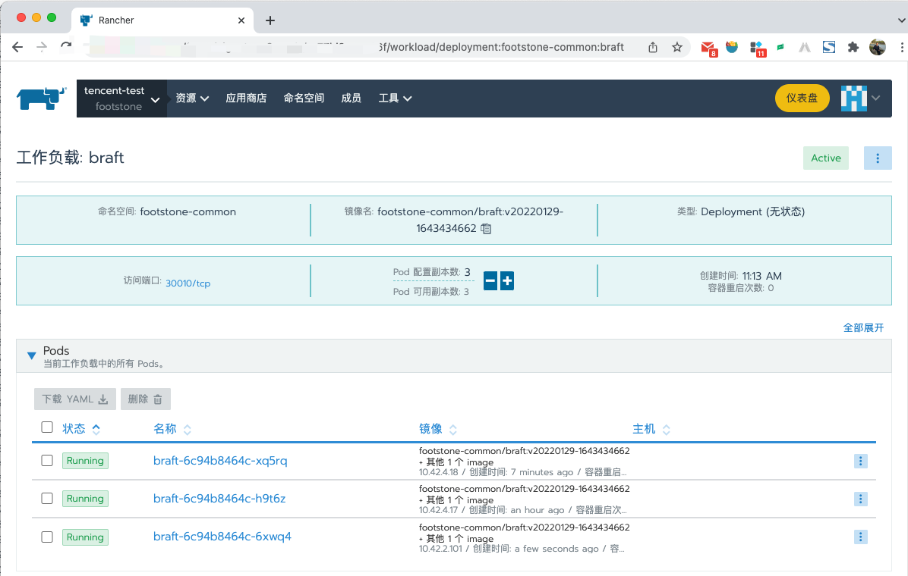

## postRelease.sh

postRelease.sh 文件中注意：

1. namespace 要对应上， `--namespace footstone-common` 与 命令行中的 `K8N=footstone-common`
1. `--src braft` 参数需要与 jarvis 中的 “项目编码(英文)” 对应
1. `--port 15002` 内部端口，`--nodePort 30010` 外部端口
1. `--cmd "K8S_SLEEP=30-50s BDI=k8s K8L=svc=braft ./braft"` 指定启动命令，环境变量见 braft README 中的 k8s 节点发现部分
1. 一套集群中，标签是惟一的，例如上面的 svc=braft (命令中有两处，需要同时改动)
1. 集群部署节点数量，在 `--replicaCount 3`, raft 集群建议至少 3 个节点
1. `--namespace footstone-common` 咨询 k8s 管理员，做合适调整
1. `-serviceAccountName braftdemo` 需要对账号进行 k8s API 的授权

## rancher



## raft status

```sh
[root@tecent-beta11 ~]# gurl :30010/raft
GET /raft? HTTP/1.1
Host: localhost:30010
Accept: application/json
Accept-Encoding: gzip, deflate
Content-Type: application/json
User-Agent: gurl/0.1.0


HTTP/1.1 200 OK
Content-Type: application/json; charset=utf-8
Date: Sat, 29 Jan 2022 06:33:12 GMT
Content-Length: 1851

{
  "CurrentLeader": false,
  "Discovery": "k8s://ns=/labels=svc:braft/portName=",
  "Leader": "10.42.4.17:15000",
  "NodeNum": 3,
  "Nodes": [
    {
      "Leader": "10.42.4.17:15000",
      "ServerID": "hqJJRLsyNE1KbXRDWjZuMzFTeWkxbUFtN0JDanhHYUWlUnBvcnTNOpilRHBvcnTNOpmlSHBvcnTNOpqoSG9zdG5hbWW2YnJhZnQtNmM5NGI4NDY0Yy1oOXQ2eqJJUJGqMTAuNDIuNC4xNw",
      "Address": "10.42.4.17:15000",
      "RaftState": "Leader",
      "RaftPort": 15000,
      "DiscoveryPort": 15001,
      "HTTPPort": 15002,
      "RaftID": {
        "ID": "24MJmtCZ6n31Syi1mAm7BCjxGaE",
        "Rport": 15000,
        "Dport": 15001,
        "Hport": 15002,
        "Hostname": "braft-6c94b8464c-h9t6z",
        "IP": [
          "10.42.4.17"
        ]
      },
      "DiscoveryNodes": [
        "10.42.2.101",
        "10.42.4.17",
        "10.42.4.18"
      ],
      "StartTime": "2022-01-29T13:38:04.969813479+08:00",
      "Duration": "55m7.90619128s"
    },
    {
      "Leader": "10.42.4.17:15000",
      "ServerID": "hqJJRLsyNE1PdEE3bHdXbGQwRGk2clptQk8zVFVwb3elUnBvcnTNOpilRHBvcnTNOpmlSHBvcnTNOpqoSG9zdG5hbWW2YnJhZnQtNmM5NGI4NDY0Yy14cTVycaJJUJGqMTAuNDIuNC4xOA",
      "Address": "10.42.4.18:15000",
      "RaftState": "Follower",
      "RaftPort": 15000,
      "DiscoveryPort": 15001,
      "HTTPPort": 15002,
      "RaftID": {
        "ID": "24MOtA7lwWld0Di6rZmBO3TUpow",
        "Rport": 15000,
        "Dport": 15001,
        "Hport": 15002,
        "Hostname": "braft-6c94b8464c-xq5rq",
        "IP": [
          "10.42.4.18"
        ]
      },
      "DiscoveryNodes": [
        "10.42.2.101",
        "10.42.4.17",
        "10.42.4.18"
      ],
      "StartTime": "2022-01-29T14:20:00.47490657+08:00",
      "Duration": "13m12.423287229s"
    },
    {
      "Leader": "10.42.4.17:15000",
      "ServerID": "hqJJRLsyNE1QbEc1R1pTQTVBMkZzSTVGNExaOGF0eHSlUnBvcnTNOpilRHBvcnTNOpmlSHBvcnTNOpqoSG9zdG5hbWW2YnJhZnQtNmM5NGI4NDY0Yy02eHdxNKJJUJGrMTAuNDIuMi4xMDE",
      "Address": "10.42.2.101:15000",
      "RaftState": "Follower",
      "RaftPort": 15000,
      "DiscoveryPort": 15001,
      "HTTPPort": 15002,
      "RaftID": {
        "ID": "24MPlG5GZSA5A2FsI5F4LZ8atxt",
        "Rport": 15000,
        "Dport": 15001,
        "Hport": 15002,
        "Hostname": "braft-6c94b8464c-6xwq4",
        "IP": [
          "10.42.2.101"
        ]
      },
      "DiscoveryNodes": [
        "10.42.2.101",
        "10.42.4.17",
        "10.42.4.18"
      ],
      "StartTime": "2022-01-29T14:27:11.613397146+08:00",
      "Duration": "6m1.310356617s"
    }
  ]
}
```
